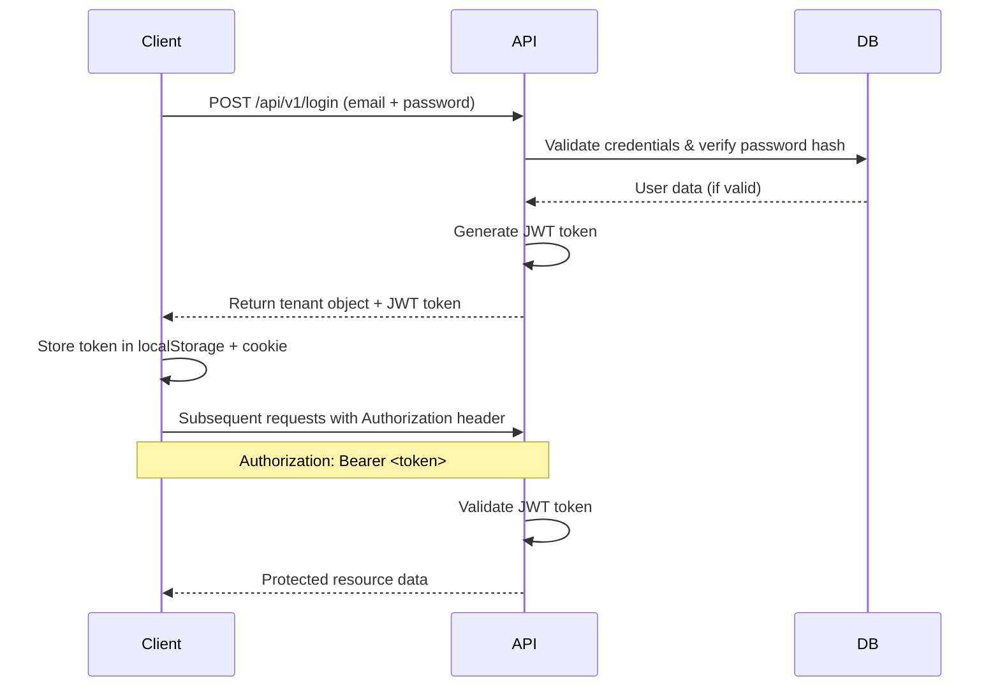

# API Reference

Complete API documentation for the Service Management Platform.

## Table of Contents

- [Base URL](#base-url)
- [Authentication](#authentication)
- [API Endpoints](#api-endpoints)
  - [Authentication](#authentication-endpoints)
  - [Services](#service-endpoints)
  - [Billing](#billing-endpoints)
  - [Payments](#payment-endpoints)
  - [Notifications](#notification-endpoints)
- [GraphQL API](#graphql-api)
- [Error Handling](#error-handling)

## Base URL

```
Development: http://localhost:3000/api
Production: http://52.66.102.217:3000/api
```

**Interactive Documentation:** http://localhost:3000/api-docs

## Authentication

The API uses **JWT (JSON Web Token)** authentication with role-based access control (RBAC).

### Authentication Methods

1. **JWT Bearer Token** - Include in Authorization header: `Authorization: Bearer <token>`
2. **Cookie-based** - Automatically sent by browsers for admin dashboard access

### Access Control Roles

| Role | Access Level | Description |
|------|--------------|-------------|
| **User** | Standard | Access to own services, billing, and orders |
| **Admin** | Administrator | Full system access including user management and admin dashboard |

**See [Admin Access Guide](../ADMIN_ACCESS_GUIDE.md) for admin setup and [Security Guide](SECURITY.md) for security implementation details.**

### Authentication Flow



### How to Authenticate

1. **Sign up** or **login** to get a JWT token
2. **Store the token** (returned in response)
3. **Include the token** in subsequent API calls:
   ```bash
   Authorization: Bearer YOUR_JWT_TOKEN
   ```

## API Endpoints

### Authentication Endpoints

#### 1. User Login

**Endpoint:** `POST /api/v1/login`

Authenticate a tenant and retrieve account information.

**Request Body:**
```json
{
  "email": "user@example.com",
  "password": "securePassword123"
}
```

**Response (200 OK):**
```json
{
  "id": 1,
  "name": "John Doe",
  "companyName": "Example Corp",
  "email": "user@example.com",
  "phone": "+1234567890",
  "address": "123 Main St, City, State",
  "status": "active",
  "role": "user",
  "token": "eyJhbGciOiJIUzI1NiIsInR5cCI6IkpXVCJ9...",
  "createdAt": "2025-01-15T10:30:00Z"
}
```

**Response Headers:**
- `Set-Cookie: authToken=<token>; HttpOnly; Secure; SameSite=Strict`

**Error Responses:**
- `400 Bad Request` - Missing email or password
- `401 Unauthorized` - Invalid credentials

**Note:** Password is hashed with bcrypt (10 salt rounds) and never returned in responses.


#### 2. Create Tenant (Signup)

**Endpoint:** `POST /api/v1/tenants`

Register a new tenant account.

**Request Body:**
```json
{
  "name": "John Doe",
  "companyName": "Example Corp",
  "email": "john@example.com",
  "phone": "+1234567890",
  "billingAddress": "123 Main St, City, State",
  "status": "active",
  "password": "securePassword123"
}
```

**Response (201 Created):**
```json
{
  "id": 5,
  "name": "John Doe",
  "companyName": "Example Corp",
  "email": "john@example.com",
  "phone": "+1234567890",
  "address": "123 Main St, City, State",
  "status": "active",
  "role": "user",
  "token": "eyJhbGciOiJIUzI1NiIsInR5cCI6IkpXVCJ9...",
  "createdAt": "2025-01-15T10:30:00Z"
}
```

**Error Responses:**
- `400 Bad Request` - Missing required fields or password too short (min 8 chars)
- `400 Bad Request` - Email already exists

**Note:** 
- Token is automatically generated upon signup for immediate login
- Password must be at least 8 characters
- Password is hashed with bcrypt before storage


#### 3. Get All Tenants

**Endpoint:** `GET /api/v1/tenants`

**Authentication Required:** Yes (Admin only)

Retrieve list of all registered tenants. This endpoint requires admin role.

**Headers:**
```
Authorization: Bearer <admin_jwt_token>
```

**Response (200 OK):**
```json
[
  {
    "id": 1,
    "name": "John Doe",
    "companyName": "Example Corp",
    "email": "john@example.com",
    "status": "active"
  }
]
```


#### 4. Get Tenant by ID

**Endpoint:** `GET /api/v1/tenants/:id`

**Parameters:**
- `id` (path) - Tenant ID

**Response (200 OK):**
```json
{
  "id": 1,
  "name": "John Doe",
  "companyName": "Example Corp",
  "email": "john@example.com",
  "phone": "+1234567890",
  "billingAddress": "123 Main St",
  "status": "active"
}
```


#### 5. Update Tenant

**Endpoint:** `PUT /api/v1/tenants/:id`

**Request Body:**
```json
{
  "name": "Jane Doe",
  "phone": "+1987654321",
  "billingAddress": "456 New St"
}
```

**Response (200 OK):**
```json
{
  "id": 1,
  "name": "Jane Doe",
  "email": "john@example.com",
  "phone": "+1987654321",
  "billingAddress": "456 New St",
  "status": "active"
}
```


#### 6. Delete Tenant

**Endpoint:** `DELETE /api/v1/tenants/:id`

**Response (200 OK):**
```json
{
  "message": "Tenant deleted successfully"
}
```


### Service Endpoints

#### 1. Get All Services

**Endpoint:** `GET /api/v1/services`

Retrieve complete service catalog.

**Response (200 OK):**
```json
[
  {
    "id": 1,
    "name": "AWS EC2 Instance",
    "pricePerHour": 0.10,
    "categoryId": 1,
    "categoryName": "Cloud Services",
    "subServiceId": 101,
    "subServiceName": "Compute"
  }
]
```


#### 2. Get Service by ID

**Endpoint:** `GET /api/v1/services/:serviceId`

**Parameters:**
- `serviceId` (path) - Service ID

**Response (200 OK):**
```json
{
  "id": 1,
  "name": "AWS EC2 Instance",
  "pricePerHour": 0.10,
  "categoryId": 1,
  "categoryName": "Cloud Services",
  "subServiceId": 101,
  "subServiceName": "Compute",
  "description": "Scalable compute capacity in the cloud"
}
```


#### 3. Get Categories

**Endpoint:** `GET /api/v1/categories`

**Response (200 OK):**
```json
[
  {
    "id": 1,
    "name": "Cloud Services"
  },
  {
    "id": 2,
    "name": "Software Development"
  }
]
```


#### 4. Get Price Estimate

**Endpoint:** `GET /api/v1/services/:serviceId/price-estimate`

**Query Parameters:**
- `hours` (query) - Number of hours

**Example:** `/api/v1/services/1/price-estimate?hours=100`

**Response (200 OK):**
```json
{
  "serviceId": 1,
  "serviceName": "AWS EC2 Instance",
  "pricePerHour": 0.10,
  "hours": 100,
  "estimatedCost": 10.00
}
```


### Billing Endpoints

#### 1. Create Bill

**Endpoint:** `POST /api/v1/bills`

**Request Body:**
```json
{
  "serviceId": 1,
  "tenantId": 5,
  "hours": 100
}
```

**Response (201 Created):**
```json
{
  "id": 1,
  "serviceId": 1,
  "tenantId": 5,
  "billAmount": 10.00,
  "hours": 100,
  "status": "pending",
  "createdAt": "2025-01-15T10:30:00Z"
}
```


#### 2. Get Bills by Tenant

**Endpoint:** `GET /api/v1/bills/:tenantId`

**Response (200 OK):**
```json
[
  {
    "id": 1,
    "serviceId": 1,
    "serviceName": "AWS EC2 Instance",
    "billAmount": 10.00,
    "hours": 100,
    "status": "pending",
    "createdAt": "2025-01-15T10:30:00Z"
  }
]
```


#### 3. Update Bill Status

**Endpoint:** `PUT /api/v1/bills/:billId`

**Request Body:**
```json
{
  "status": "paid"
}
```

**Response (200 OK):**
```json
{
  "id": 1,
  "status": "paid",
  "updatedAt": "2025-01-15T11:00:00Z"
}
```


### Payment Endpoints

#### 1. Process Payment

**Endpoint:** `POST /api/v1/payment`

**Request Body:**
```json
{
  "billId": 1,
  "tenantId": 5,
  "amount": 10.00,
  "paymentMethod": "credit_card",
  "status": "completed"
}
```

**Response (201 Created):**
```json
{
  "id": 1,
  "billId": 1,
  "tenantId": 5,
  "amount": 10.00,
  "paymentMethod": "credit_card",
  "status": "completed",
  "transactionDate": "2025-01-15T11:00:00Z"
}
```

**Payment Status Values:**
- `pending` - Payment initiated
- `completed` - Payment successful
- `failed` - Payment failed
- `refunded` - Payment refunded


### Notification Endpoints

#### 1. Get All Notifications

**Endpoint:** `GET /api/v1/notifications`

**Response (200 OK):**
```json
[
  {
    "id": 1,
    "type": "billing",
    "message": "New bill generated for service: AWS EC2 Instance",
    "tenantId": 5,
    "createdAt": "2025-01-15T10:30:00Z",
    "read": false
  }
]
```


#### 2. Get Notifications by Type

**Endpoint:** `GET /api/v1/notifications/type/:type`

**Parameters:**
- `type` (path) - Notification type (`billing`, `payment`, `service`, `system`)

**Response (200 OK):**
```json
[
  {
    "id": 1,
    "type": "billing",
    "message": "New bill generated",
    "tenantId": 5,
    "createdAt": "2025-01-15T10:30:00Z"
  }
]
```


#### 3. Create Notification

**Endpoint:** `POST /api/v1/notifications`

**Request Body:**
```json
{
  "type": "system",
  "message": "System maintenance scheduled",
  "tenantId": 5
}
```

**Response (201 Created):**
```json
{
  "id": 2,
  "type": "system",
  "message": "System maintenance scheduled",
  "tenantId": 5,
  "createdAt": "2025-01-15T12:00:00Z",
  "read": false
}
```


#### 4. Get Notification by ID

**Endpoint:** `GET /api/v1/notifications/:id`

**Response (200 OK):**
```json
{
  "id": 1,
  "type": "billing",
  "message": "New bill generated",
  "tenantId": 5,
  "createdAt": "2025-01-15T10:30:00Z",
  "read": false
}
```


## GraphQL API

**Endpoint:** `http://localhost:3000/graphql`

### Example Queries

#### Get All Services

```graphql
query {
  services {
    id
    name
    pricePerHour
    categoryName
    subServiceName
  }
}
```

#### Get Service by ID

```graphql
query {
  service(id: 1) {
    id
    name
    pricePerHour
    categoryName
    subServiceName
  }
}
```

#### Get Categories

```graphql
query {
  categories {
    id
    name
  }
}
```


## Error Handling

All API endpoints return consistent error responses:

### Error Response Format

```json
{
  "error": "Error message describing what went wrong"
}
```

### HTTP Status Codes

| Code | Meaning | Description |
|------|---------|-------------|
| `200` | OK | Request successful |
| `201` | Created | Resource created successfully |
| `400` | Bad Request | Invalid request parameters |
| `401` | Unauthorized | Authentication failed |
| `404` | Not Found | Resource not found |
| `500` | Internal Server Error | Server error occurred |


## Rate Limiting

Currently, the API does not implement rate limiting. For production deployment, consider:

- **Rate Limit:** 100 requests per minute per IP
- **Burst Limit:** 200 requests
- **Response Headers:**
  - `X-RateLimit-Limit`
  - `X-RateLimit-Remaining`
  - `X-RateLimit-Reset`


## API Versioning

The API uses URL versioning:

- Current version: `v1`
- Base path: `/api/v1/*`

Future versions will be available at `/api/v2/*`, etc.


## Testing the API

### Using cURL

```bash
# Login
curl -X POST http://localhost:3000/api/v1/login \
  -H "Content-Type: application/json" \
  -d '{"email": "user@example.com", "password": "password123"}'

# Get all services
curl http://localhost:3000/api/v1/services

# Create a bill
curl -X POST http://localhost:3000/api/v1/bills \
  -H "Content-Type: application/json" \
  -d '{"serviceId": 1, "tenantId": 5, "hours": 100}'
```

### Using Swagger UI

Visit http://localhost:3000/api-docs for an interactive API explorer where you can:
- View all endpoints
- Test API calls
- See request/response schemas
- Download OpenAPI specification


## Support

For API support or questions:
- **GitHub Issues:** [Report an issue](https://github.com/BITSSAP2025AugAPIBP3Sections/APIBP-20242YA-Team-3/issues)
- **Email:** support@example.com
- **Documentation:** [View all docs](../README.md)


**[← Back to README](../README.md)** | **[View Architecture →](ARCHITECTURE.md)**
