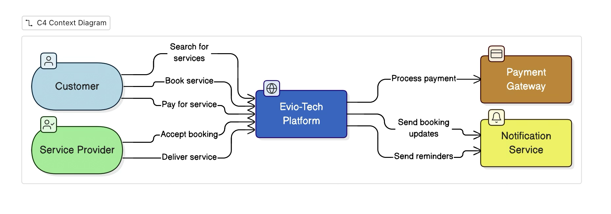
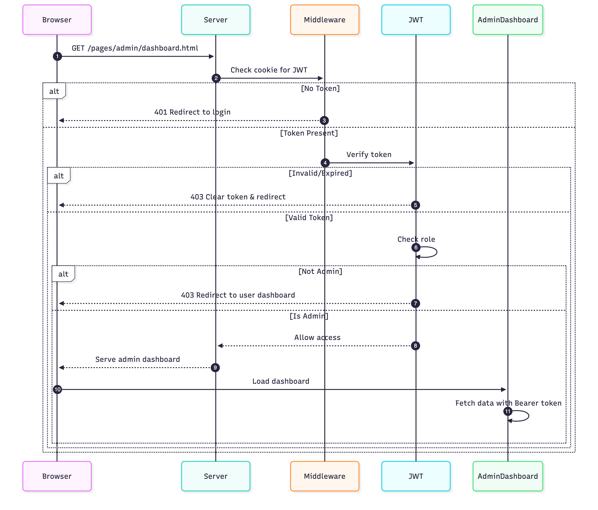
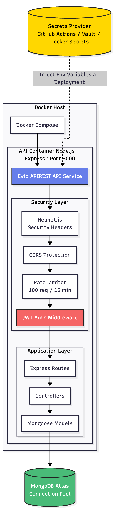

# System Architecture

Complete architectural overview of the Service Management Platform.


## Table of Contents

- [Overview](#overview)
- [System Context Diagram](#system-context-diagram)
- [System Architecture](#system-architecture)
- [Component Diagrams](#component-diagrams)
- [Data Flow](#data-flow)
- [Technology Stack](#technology-stack)
- [Security Architecture](#security-architecture)
- [Deployment Architecture](#deployment-architecture)
- [Database Schema](#database-schema)
- [API Architecture](#api-architecture)
- [GraphQL Schema](#graphql-schema)


## Overview

The Service Management Platform is a multi-tenant SaaS application built with a modern microservices-inspired architecture. It provides service catalog management, billing, payments, and real-time notifications through REST and GraphQL APIs.

### Key Architectural Principles

- **Multi-tenant** - Isolated data per tenant with role-based access control
- **API-First** - RESTful and GraphQL interfaces
- **Secure by Design** - JWT authentication, bcrypt hashing, rate limiting **[Security](SECURITY.md)**
- **Scalable** - Stateless architecture with horizontal scaling capability
- **Cloud-Native** - Docker and Kubernetes ready
- **Event-Driven** - Real-time notification system

## System Architecture

### High-Level Architecture

### Component Diagrams


### Context Diagrams



### Directory Structure

```
APIBP-20242YA-Team-3/
├── index.js                    # Application entry point
├── package.json                # Dependencies
├── README.md                   # Project documentation
│
├── src/
│   ├── config/
│   │   ├── database.js        # MongoDB connection
│   │   └── swagger.js         # API documentation config
│   │
│   ├── controllers/
│   │   ├── auth.controller.js      # Authentication & user management
│   │   ├── service.controller.js   # Service management & GraphQL
│   │   ├── billing.controller.js   # Billing operations
│   │   ├── payment.controller.js   # Payment processing
│   │   └── notification.controller.js  # Notifications
│   │
│   ├── middleware/
│   │   └── auth.middleware.js     # JWT authentication & RBAC
│   │
│   ├── models/
│   │   ├── Tenant.js          # User/tenant schema (with role field)
│   │   ├── Service.js         # Service schema
│   │   ├── Bill.js            # Billing schema
│   │   └── Notification.js    # Notification schema
│   │
│   └── utils/
│       └── logger.js          # Logging utility (Log4js)
│
├── public/                    # Static frontend files
│   ├── index.html
│   ├── css/
│   ├── js/
│   │   └── auth-helper.js    # Frontend auth utilities
│   └── pages/
│       ├── auth/              # Login/Signup pages
│       ├── admin/             # Admin dashboard (protected)
│       ├── dashboard/         # User dashboard
│       └── orders/            # Order management
│
├── docs/                      # Documentation
│   ├── API.md
│   ├── ARCHITECTURE.md
│   ├── INSTALLATION.md
│   └── ...
│
├── deployment/               # Deployment configs
│   ├── docker/
│   ├── kubernetes/
│   └── aws/
│
├── scripts/                 # Utility scripts
├── tests/                   # Test files
└── logs/                    # Application logs
```


## Data Flow

### User Authentication Flow


### Admin Dashboard Access Flow



### Service Ordering Flow


### Payment Processing Flow


     

### API Request Authentication Flow


### Notification System Flow


## Technology Stack

### Backend Technologies

| Technology | Version | Purpose |
|------------|---------|---------|
| **Node.js** | 14+ | Runtime environment |
| **Express.js** | 4.21+ | Web framework |
| **MongoDB** | 4.4+ | NoSQL database |
| **Mongoose** | 8.19+ | ODM for MongoDB |
| **Apollo Server** | 3.13+ | GraphQL server |
| **Swagger** | 6.2+ | API documentation |
| **Log4js** | 6.9+ | Logging framework |

### Security Packages

| Package | Version | Purpose |
|---------|---------|---------|
| **bcrypt** | 5.x | Password hashing with salt rounds |
| **jsonwebtoken** | 9.x | JWT token generation and verification |
| **helmet** | 7.x | HTTP security headers (CSP, XSS, etc.) |
| **cors** | 2.x | Cross-Origin Resource Sharing |
| **express-rate-limit** | 7.x | Rate limiting middleware |
| **cookie-parser** | 1.x | Cookie parsing for admin protection |

### Frontend Technologies

| Technology | Purpose |
|------------|---------|
| **HTML5** | Semantic markup |
| **CSS3** | Styling and animations |
| **JavaScript (ES6+)** | Client-side logic |
| **Fetch API** | HTTP requests |
| **localStorage** | Client-side token storage |
| **Cookies** | Server-side session management |

### DevOps & Infrastructure

| Technology | Purpose |
|------------|---------|
| **Docker** | Containerization |
| **Kubernetes** | Orchestration |
| **Nginx** | Reverse proxy |
| **AWS EC2** | Cloud hosting |
| **GitHub Actions** | CI/CD (planned) |


## Security Architecture

### Security Layers


   

### Security Features

#### Implemented

##### Authentication & Authorization
- **Password Hashing** - bcrypt with 10 salt rounds, minimum 8 characters
- **JWT Authentication** - Token-based auth with 24h expiry, Bearer format
- **Cookie-based Session** - Dual storage (localStorage + cookies) for admin protection
- **Role-Based Access Control (RBAC)** - User and Admin roles with granular permissions
- **Admin Creation Endpoint** - Secure admin account creation with setup key
- **Token Validation** - JWT signature verification on every request

##### Network & Transport Security
- **Security Headers** - Helmet.js (CSP, X-Frame-Options, XSS Protection, HSTS)
- **CORS Protection** - Configurable origin policies, credentials support
- **Rate Limiting** - 100 req/15min (API), 5 req/15min (auth login)
- **CSP Configuration** - Content Security Policy with inline handler support

##### Data Protection
- **Input Validation** - Server-side validation on all endpoints
- **Mongoose Query Sanitization** - Built-in NoSQL injection prevention
- **Password Requirements** - Minimum length, secure hashing
- **Request Payload Validation** - Type checking and required field validation

##### Monitoring & Logging
- **Structured Logging** - Log4js (access, error, debug logs)
- **Error Handling Middleware** - Secure error responses without stack traces
- **Request Logging** - IP, method, URL, status tracking
- **Authentication Logging** - Login attempts, token generation tracking

##### Protected Routes

**Admin Only:**
- `GET /api/v1/tenants` - View all users
- `POST /api/v1/services` - Create new services
- `PUT /api/v1/services/:id` - Update services
- `POST /api/v1/tenants/admin` - Create admin accounts (requires existing admin token or setup key)

**Owner or Admin:**
- `GET /api/v1/tenants/:id` - View specific user
- `PUT /api/v1/tenants/:id` - Update user
- `DELETE /api/v1/tenants/:id` - Delete user
- `GET /api/v1/tenants/:tenantId/bills` - View user's bills
- `PUT /api/v1/bills/:id` - Update bill status

**Authenticated Users:**
- `POST /api/v1/bills` - Create new bill
- `GET /api/v1/bills/:billId` - View specific bill
- `POST /api/v1/payment` - Process payment
- `GET /api/v1/notifications` - View notifications
- `POST /api/v1/notifications` - Create notifications
- `GET /api/v1/notifications/:id` - View specific notification
- `GET /api/v1/notifications/type/:type` - Filter notifications

**Public Routes (No Authentication):**
- `POST /api/v1/login` - User login
- `POST /api/v1/tenants` - User signup
- `GET /api/v1/services` - Browse services
- `GET /api/v1/services/:id` - View service details
- `GET /api/v1/bills` - Browse bills (public listing)

##### Admin Dashboard Protection
- **Backend Middleware** - JWT + role validation before serving admin pages
- **Frontend Guards** - JavaScript-based role checks and redirects
- **Automatic Redirects** - Unauthorized users sent to login
- **Token Expiry Handling** - Automatic cleanup of expired tokens

#### Planned 🚧
- HTTPS enforcement (production deployment)
- API key management for service-to-service auth
- OAuth 2.0 integration (Google, GitHub)
- Enhanced audit logging with user action tracking
- Session management improvements (token refresh, sliding expiration)
- Password complexity rules and expiration
- Account lockout after failed login attempts


## Deployment Architecture

### Docker Deployment



## Database Schema

### Entity Relationship Diagram


### Collection Schemas

#### Tenants Collection
```javascript
{
  id: Number,                    // Auto-increment ID
  name: String,                  // Full name
  companyName: String,           // Company/organization name
  email: String (unique, indexed), // Login email
  phone: String,                 // Contact number
  address: String,               // Physical address
  billingAddress: String,        // Billing address
  status: String,                // 'active', 'suspended', 'inactive'
  password: String,              // bcrypt hashed (10 salt rounds)
  role: String,                  // 'user', 'admin' (default: 'user')
  createdAt: Date,               // Account creation timestamp
  updatedAt: Date                // Last update timestamp
}
```

#### Services Collection

### Collection Schemas

#### Tenants Collection
```javascript
{
  id: Number,                    // Auto-increment ID
  name: String,                  // Full name
  companyName: String,           // Company/organization name
  email: String (unique, indexed), // Login email
  phone: String,                 // Contact number
  address: String,               // Physical address
  billingAddress: String,        // Billing address
  status: String,                // 'active', 'suspended', 'inactive'
  password: String,              // bcrypt hashed (10 salt rounds)
  role: String,                  // 'user', 'admin' (default: 'user')
  createdAt: Date,               // Account creation timestamp
  updatedAt: Date                // Last update timestamp
}
```

#### Services Collection
```javascript
{
  id: Number,                    // Auto-increment ID
  name: String,                  // Service name
  pricePerHour: Number,          // Hourly rate
  categoryId: Number,            // Category reference
  categoryName: String,          // Category display name
  subServiceId: Number,          // Sub-service reference
  subServiceName: String,        // Sub-service display name
  description: String,           // Service description
  createdAt: Date,               // Service creation timestamp
  updatedAt: Date                // Last update timestamp
}
```

#### Bills Collection
```javascript
{
  id: Number,                    // Auto-increment ID
  serviceId: Number,             // Reference to Service
  tenantId: Number,              // Owner reference (FK to Tenant)
  billAmount: Number,            // Total amount
  hours: Number,                 // Service hours
  status: String,                // 'pending', 'paid', 'overdue'
  createdAt: Date,               // Bill creation timestamp
  updatedAt: Date                // Last update timestamp
}
```

#### Payments Collection
```javascript
{
  id: Number,                    // Auto-increment ID
  billId: Number,                // Reference to Bill
  tenantId: Number,              // Owner reference (FK to Tenant)
  amount: Number,                // Payment amount
  paymentMethod: String,         // 'credit_card', 'debit_card', 'paypal'
  status: String,                // 'pending', 'completed', 'failed'
  transactionId: String,         // Payment gateway transaction ID
  transactionDate: Date,         // Payment timestamp
  createdAt: Date                // Record creation timestamp
}
```

#### Notifications Collection
```javascript
{
  id: Number,                    // Auto-increment ID
  type: String,                  // 'billing', 'payment', 'service', 'system'
  message: String,               // Notification content
  tenantId: Number,              // Receiver reference (FK to Tenant)
  read: Boolean,                 // Read status (default: false)
  createdAt: Date,               // Notification timestamp
  updatedAt: Date                // Last update timestamp
}
```


## API Architecture

### RESTful API Design

```
/api/v1
├── /login                    POST   - User authentication
├── /tenants                  GET    - List all tenants
├── /tenants                  POST   - Create tenant
├── /tenants/:id              GET    - Get tenant by ID
├── /tenants/:id              PUT    - Update tenant
├── /tenants/:id              DELETE - Delete tenant
├── /services                 GET    - List all services
├── /services/:id             GET    - Get service by ID
├── /services/:id/price-estimate GET - Get price estimate
├── /categories               GET    - List categories
├── /bills                    POST   - Create bill
├── /bills/:tenantId          GET    - Get tenant bills
├── /bills/:id                PUT    - Update bill
├── /payment                  POST   - Process payment
├── /notifications            GET    - List notifications
├── /notifications            POST   - Create notification
├── /notifications/type/:type GET    - Get by type
└── /notifications/:id        GET    - Get by ID
```

### GraphQL Schema

```graphql
type Service {
  id: Int!
  name: String!
  pricePerHour: Float!
  categoryId: Int!
  categoryName: String!
  subServiceId: Int!
  subServiceName: String!
  description: String
  createdAt: String
  updatedAt: String
}

type Category {
  id: Int!
  name: String!
  services: [Service]
}

type SubService {
  id: Int!
  name: String!
  categoryId: Int!
}

type Query {
  services: [Service]
  service(id: Int!): Service
  categories: [Category]
  category(id: Int!): Category
  subServices(categoryId: Int!): [SubService]
}
```

### GraphQL Endpoint

**URL:** `POST /graphql`

**Example Query - Get All Services:**
```graphql
query {
  services {
    id
    name
    pricePerHour
    categoryName
    subServiceName
    description
  }
}
```

**Example Query - Get Service by ID:**
```graphql
query {
  service(id: 1) {
    id
    name
    pricePerHour
    categoryId
    categoryName
    subServiceId
    subServiceName
    description
  }
}
```

**Example Query - Get Categories with Services:**
```graphql
query {
  categories {
    id
    name
    services {
      id
      name
      pricePerHour
    }
  }
}
```

**Example Query - Get Category by ID:**
```graphql
query {
  category(id: 1) {
    id
    name
    services {
      id
      name
      pricePerHour
    }
  }
}
```

**Example Query - Get SubServices by Category:**
```graphql
query {
  subServices(categoryId: 1) {
    id
    name
    categoryId
  }
}
```


## Performance Considerations

### Optimization Strategies

1. **Database Indexing**
   - Index on `email` for tenant lookups
   - Index on `tenantId` for bills and notifications
   - Compound indexes for frequent queries

2. **Caching Strategy** (Planned)
   - Redis for session storage
   - Cache service catalog
   - Cache category listings

3. **API Response Optimization**
   - Pagination for list endpoints
   - Field selection in GraphQL
   - Gzip compression

4. **Scaling Strategy**
   - Horizontal scaling with load balancer
   - Stateless application design
   - Database connection pooling


## Monitoring & Logging

### Logging Architecture

```
Application Logs
├── access.log     - HTTP request logs
├── error.log      - Application errors
└── debug.log      - Debug information
```

### Monitoring Stack (Planned)

- **Application Monitoring:** New Relic / Datadog
- **Infrastructure Monitoring:** CloudWatch / Prometheus
- **Log Aggregation:** ELK Stack (Elasticsearch, Logstash, Kibana)
- **APM:** Application Performance Monitoring
- **Alerting:** PagerDuty / Slack integration

**[← Back to README](../README.md)** | **[View API Reference →](API.md)** | **[Installation Guide →](INSTALLATION.md)** | **[Security](SECURITY.md)**
