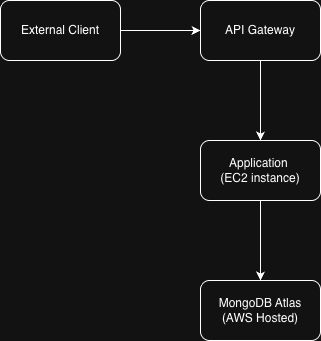
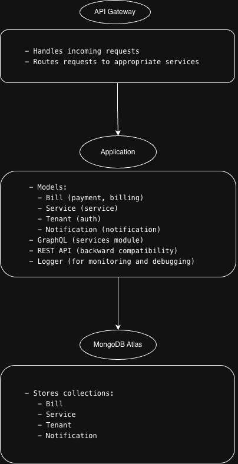
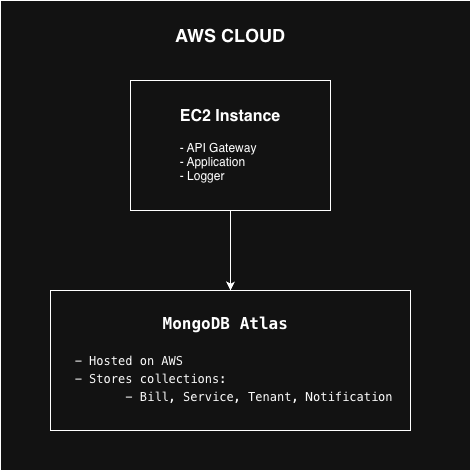

# Documentation


Complete documentation for the Service Management Platform.

## Quick Links## Quick Links


- [Installation Guide](INSTALLATION.md) - Setup and deployment instructions- [Installation Guide](INSTALLATION.md) - Setup and deployment instructions

- [API Reference](API.md) - Complete API documentation- [API Reference](API.md) - Complete API documentation

- [Architecture](ARCHITECTURE.md) - System design and components- [Architecture](ARCHITECTURE.md) - System design and components

- [Security Policy](SECURITY.md) - Security practices and reporting- [Security Policy](SECURITY.md) - Security practices and reporting

- [Contributing](CONTRIBUTING.md) - How to contribute- [Contributing](CONTRIBUTING.md) - How to contribute

- [Quick Start](QUICKSTART.md) - Get started in 5 minutes- [Quick Start](QUICKSTART.md) - Get started in 5 minutes


## Documentation Index#


| Document | Description |

|----------|-------------|

| [API Reference](API.md) | REST and GraphQL API endpoints, authentication, examples || [API Reference](API.md) | REST and GraphQL API endpoints, authentication, examples |

| [Architecture](ARCHITECTURE.md) | System architecture, data flow, technology stack || [Architecture](ARCHITECTURE.md) | System architecture, data flow, technology stack |

| [Installation](INSTALLATION.md) | Docker, Kubernetes, local, and AWS deployment || [Installation](INSTALLATION.md) | Docker, Kubernetes, local, and AWS deployment |

| [Quick Start](QUICKSTART.md) | Fast setup guide for new users || [Quick Start](QUICKSTART.md) | Fast setup guide for new users |

| [Security](SECURITY.md) | Security features, reporting vulnerabilities || [Security](SECURITY.md) | Security features, reporting vulnerabilities |

| [User Journey](USER_JOURNEY.md) | Complete user workflows and scenarios || [User Journey](USER_JOURNEY.md) | Complete user workflows and scenarios |

| [Dashboard Guide](DASHBOARD_GUIDE.md) | Using the admin dashboard || [Dashboard Guide](DASHBOARD_GUIDE.md) | Using the admin dashboard |

| [Navigation Guide](NAVIGATION_GUIDE.md) | UI navigation reference || [Navigation Guide](NAVIGATION_GUIDE.md) | UI navigation reference |

| [Contributing](CONTRIBUTING.md) | Contribution guidelines and workflow || [Contributing](CONTRIBUTING.md) | Contribution guidelines and workflow |

| [Code of Conduct](CODE_OF_CONDUCT.md) | Community standards || [Code of Conduct](CODE_OF_CONDUCT.md) | Community standards |


## Getting Help


- **Live Demo:** [http://52.66.102.217:3000/api-docs](http://52.66.102.217:3000/api-docs/)- **Live Demo:** [http://52.66.102.217:3000/api-docs](http://52.66.102.217:3000/api-docs/)

- **GitHub Issues:** [Report bugs or request features](https://github.com/BITSSAP2025AugAPIBP3Sections/APIBP-20242YA-Team-3/issues)- **GitHub Issues:** [Report bugs or request features](https://github.com/BITSSAP2025AugAPIBP3Sections/APIBP-20242YA-Team-3/issues)

- **Main README:** [Back to project home](../README.md)


### Method 1: Docker Compose (🔥 Recommended - Easiest)

**Perfect for:** First-time setup, development, testing  
**Time to run:** 2 minutes

```bash
# 1. Navigate to the project directory
cd APIBP-20242YA-Team-3

# 2. Start everything (MongoDB + API)
docker-compose up -d

# 3. Wait 30 seconds, then test
curl http://localhost:3000/api/v1/services
curl http://localhost:3000/api/v1/tenants

# 4. View API documentation
open http://localhost:3000/api-docs
```

**✅ What you get automatically:**
- MongoDB Atlas connection
- Your API server (all endpoints working)
- Real-time event notifications
- No manual setup required


### Method 2: Kubernetes with Minikube (Production-like)

**Perfect for:** Learning Kubernetes, production simulation  
**Time to run:** 5 minutes

```bash
# 1. Navigate to the project directory
cd APIBP-20242YA-Team-3

# 2. Start Minikube
minikube start

# 3. Build and deploy to Kubernetes
eval $(minikube docker-env)
docker build -t service-api:latest .
kubectl apply -f k8s-configmap.yaml
kubectl apply -f k8s-deployment.yaml

# 4. Get the service URL
minikube service service-api --url
# Use the returned URL (e.g., http://127.0.0.1:58583) to test:
curl <RETURNED_URL>/api/v1/services
```


### Method 3: Manual Setup (Development Mode)

**Perfect for:** Code development, debugging, learning the codebase  
**Time to run:** 3 minutes

```bash
# 1. Navigate to the project directory
cd APIBP-20242YA-Team-3

# 2. Install dependencies
npm install
# If you get dependency conflicts, use:
# npm install --legacy-peer-deps

# 3. Start MongoDB services only
docker-compose up -d

# 4. Start the API server manually
npm start
# or: node index.js

# 5. Test
curl http://localhost:3000/api/v1/services
```


## 📋 Prerequisites by Method

### Docker Compose:
- **Docker Desktop** (Windows/Mac) or **Docker + Compose** (Linux)
- That's it! 🎉

### Kubernetes:
- **Docker Desktop** (Windows/Mac) or **Docker** (Linux)
- **Minikube** ([Install Guide](https://minikube.sigs.k8s.io/docs/start/))
- **kubectl** (usually comes with Docker Desktop)

### Manual Setup:
- **Node.js 14+** ([Download](https://nodejs.org/))
- **npm** (comes with Node.js)
- **MongoDB Atlas Account** (or local MongoDB)


## ⚡ Quick API Test Suite

Once running, test your deployment with these commands:

```bash
# Replace localhost:3000 with your service URL (for Kubernetes)

# 1. List all services (should return JSON array)
curl http://localhost:3000/api/v1/services

# 2. Get specific service details
curl http://localhost:3000/api/v1/services/1011

# 3. List all tenants
curl http://localhost:3000/api/v1/tenants

# 4. Create a new bill (triggers notification)
curl -X POST -H "Content-Type: application/json" \
  -d '{"serviceId": 1011, "tenantId": 1, "hours": 3}' \
  http://localhost:3000/api/v1/bills

# 5. Check real-time notifications
curl http://localhost:3000/api/v1/notifications

# 6. View interactive API documentation
open http://localhost:3000/api-docs
```

**Expected results:**
- Services: Returns list of 33+ services across 2 categories
- Tenants: Returns list of 5 pre-loaded tenants
- Bills: Creates bill and triggers `bill.created` notification
- Notifications: Shows stored notification events
- API Docs: Interactive Swagger UI


## 🛑 Stopping the Application

**Docker Compose:**
```bash
docker-compose down
```

**Kubernetes:**
```bash
kubectl delete -f k8s-deployment.yaml
minikube stop  # optional: stops Minikube
```

**Manual Setup:**
```bash
# Ctrl+C to stop the Node.js server
docker-compose down  # stops services
```


## 🔧 Included Deployment Files

Your repository includes everything needed for deployment:

| File | Description |
|------|-------------|
| `docker-compose.yml` | Complete stack configuration |
| `Dockerfile` | API server container definition |
| `k8s-configmap.yaml` | Kubernetes environment variables |
| `k8s-deployment.yaml` | Kubernetes deployment & service |
| `.dockerignore` | Docker build optimization |


## 🐛 Project Structure and Diagrams

### 1. System Context Diagram

This diagram shows the high-level interactions between the system and external entities.

                          

- **External Client**: Represents users or systems accessing the application.
- **API Gateway**: The entry point for all requests, implemented in index.js.
- **Application**: Hosted on a single EC2 instance, handling business logic and interacting with MongoDB.
- **MongoDB Atlas**: A cloud-hosted database storing collections like Bill, Service, Tenant, and Notification.

### 2. Container Diagram

This diagram focuses on the logical components within the system.



- **API Gateway**: Routes requests to the application.
- **Application**: Implements business logic, REST/GraphQL APIs, and interacts with MongoDB.
- **MongoDB Atlas**: Stores the application's data.

### 3. Deployment Diagram

This diagram shows the physical deployment of components.



- EC2 Instance: Hosts the application, including the API Gateway, REST/GraphQL APIs, and logger.
- MongoDB Atlas: A managed database service hosted on AWS.


## 🐛 Common Issues & Solutions

### Issue: npm dependency conflicts (ERESOLVE error)
```bash
npm error ERESOLVE could not resolve
npm error peer express@"^4.17.1" from apollo-server-express@3.13.0
```

**Solutions (try in order):**
```bash
# Option 1: Use legacy peer deps (recommended)
npm install --legacy-peer-deps

# Option 2: Force the installation
npm install --force

# Option 3: Clear cache and retry
npm cache clean --force
rm -rf node_modules package-lock.json
npm install --legacy-peer-deps
```

**Why this happens:** The project uses Express v4.x for compatibility with apollo-server-express, but npm sometimes tries to install Express v5.x.

### Issue: "Cannot connect" errors
```bash
# Check what's running
docker ps                    # Docker Compose
kubectl get pods            # Kubernetes

# Restart services
docker-compose restart      # Docker Compose
kubectl delete pod <name>   # Kubernetes
```

### Issue: Port 3000 already in use
```bash
# Find and kill the process
lsof -i :3000
kill -9 <PID>
```

### Issue: Docker not running (macOS)
```bash
# Start Docker
colima start              # if using Colima
# OR open Docker Desktop app
```


## 🧪 Available API Endpoints (28 total)

### Core Services (7 endpoints)
- `GET /api/v1/services` - List all services
- `GET /api/v1/services/{id}` - Service details
- `POST /api/v1/services` - Create service
- `PUT /api/v1/services/{id}` - Update service
- `DELETE /api/v1/services/{id}` - Delete service
- `GET /api/v1/services/{id}/price-estimate` - Price calculator
- `GET /api/v1/categories` - Service categories

### Tenant Management (6 endpoints)
- `GET /api/v1/tenants` - List tenants
- `GET /api/v1/tenants/{id}` - Tenant details
- `POST /api/v1/tenants` - Create tenant
- `PUT /api/v1/tenants/{id}` - Update tenant
- `DELETE /api/v1/tenants/{id}` - Delete tenant
- `POST /api/v1/login` - Authenticate

### Billing & Payments (5 endpoints)
- `GET /api/v1/bills` - List bills
- `GET /api/v1/bills/{id}` - Bill details
- `GET /api/v1/tenants/{id}/bills` - Tenant's bills
- `POST /api/v1/bills` - Create bill
- `POST /api/v1/payment` - Update payment status

### Real-time Notifications (3 endpoints)
- `GET /api/v1/notifications` - All notifications
- `GET /api/v1/notifications/type/{type}` - Filter by type
- `GET /api/v1/notifications/stats` - Statistics

### Documentation (1 endpoint)
- `GET /api-docs` - Interactive Swagger UI


## 🏗️ Architecture

### Module Structure
```
API Requests
    ↓
Express Middleware (JSON parsing, log4js logging)
    ↓
Route Handlers (5 modules)
    ├── Service Management
    ├── Billing & Invoicing
    ├── Payment Processing
    ├── Tenant Authentication
    └── Notification Monitoring
    ↓
Business Logic (with log4js logging)
    ↓
Data Persistence (MongoDB Atlas)
    ↓
Notification Events Stored in MongoDB
```

### Technology Stack

| Layer | Technology |
|-------|-----------|
| **Framework** | Express.js |
| **GraphQL** | Apollo Server Express |
| **Logging** | log4js |
| **API Documentation** | Swagger/OpenAPI 3.0 |
| **Data Storage** | MongoDB Atlas |
| **Runtime** | Node.js |

## 📢 Notification System

### Event Types (9 total)

| Event | Trigger | Storage |
|-------|---------|---------|
| `bill.created` | POST /bills | MongoDB Notifications |
| `bill.status.updated` | POST /payment | MongoDB Notifications |
| `payment.received` | Status → paid | MongoDB Notifications |
| `tenant.created` | POST /tenants | MongoDB Notifications |
| `tenant.updated` | PUT /tenants/{id} | MongoDB Notifications |
| `tenant.deleted` | DELETE /tenants/{id} | MongoDB Notifications |
| `service.created` | POST /services | MongoDB Notifications |
| `service.updated` | PUT /services/{id} | MongoDB Notifications |
| `service.deleted` | DELETE /services/{id} | MongoDB Notifications |

All notifications are stored directly in MongoDB Atlas and can be retrieved via the Notifications API endpoints.

## Data Models

### Service
```json
{
  "id": 1011,
  "name": "Pipe leakage repair",
  "pricePerHour": 25,
  "categoryId": 1,
  "categoryName": "Home Maintenance & Repairs",
  "subServiceId": 101,
  "subServiceName": "Plumbing"
}
```

### Tenant
```json
{
  "id": 1,
  "name": "John Doe",
  "email": "john.doe@email.com",
  "phone": "+1-555-123-4567",
  "address": "123 Main Street, Apt 4B, New York, NY 10001"
}
```

### Bill
```json
{
  "id": 1,
  "serviceId": 1011,
  "tenantId": 1,
  "billAmount": 75,
  "hours": 3,
  "date": "2025-11-01",
  "status": "pending"
}
```

### Notification
```json
{
  "id": 1,
  "type": "bill.created",
  "message": "New bill created",
  "data": {
    "billId": 14,
    "tenantId": 1,
    "serviceId": 1011,
    "amount": 75,
    "hours": 3
  },
  "createdAt": "2025-11-04T10:30:45.123Z"
}
```

## Logging System

### Log Types

| Log Type | File | Purpose |
|----------|------|---------|
| Access | `logs/access.log` | HTTP requests/responses |
| Debug | `logs/debug.log` | Application events |
| Error | `logs/error.log` | Application errors |

### Log Rotation
- Daily rotation with date pattern: `.yyyy-MM-dd`
- Console output for all levels
- Persistent file storage

## 🛡️ Features

✅ **RESTful API** - Standard HTTP methods and status codes  
✅ **GraphQL API** - Apollo Server with introspection  
✅ **Swagger Documentation** - Interactive API docs at /api-docs  
✅ **Real-time Events** - Notification storage in MongoDB  
✅ **Comprehensive Logging** - All operations logged with log4js  
✅ **Error Handling** - Graceful error responses  
✅ **Data Persistence** - MongoDB Atlas storage  
✅ **Authentication** - Email/password login  
✅ **Price Calculation** - Automatic bill calculations  
✅ **Notification Monitoring** - View events via API  
✅ **Graceful Shutdown** - Clean resource cleanup  

## 🔧 Configuration

### Environment Variables
```bash
# Currently using defaults - extend for production
PORT=3000
MONGODB_URI=<your-mongodb-atlas-uri>
LOG_LEVEL=debug
```

## 📦 Project Files

### Core Files
- `index.js` - Application entry point
- `package.json` - Dependencies and scripts

### Data Files
- `Services.json` - Service catalog (backup/seed data)
- `tenants.json` - Tenant database (backup/seed data)
- `bills.json` - Bill records (backup/seed data)

### Module Directories
- `service-module/` - Service management
- `billing-module/` - Billing system
- `payments-module/` - Payment processing
- `auth-module/` - Authentication & tenants
- `notification-module/` - Event notifications (NEW)
- `config/` - Configuration files
- `swagger/` - API documentation
- `logs/` - Application logs

## 🚦 Getting Started

### Step 1: Clone/Setup
```bash
cd ~/Desktop/OSS-API-Project
npm install
```

### Step 2: Start Services
```bash
docker-compose up -d
# Wait 30 seconds for startup
```

### Step 3: Run Application
```bash
node index.js
# Server starts on http://localhost:3000
```

### Step 4: Test
```bash
# In new terminal
curl http://localhost:3000/api/v1/services
curl http://localhost:3000/api/v1/tenants
curl http://localhost:3000/api/v1/notifications
```

### Step 5: Explore
- API Docs: `http://localhost:3000/api-docs`
- Create data: See NOTIFICATION_EXAMPLES.md
- Monitor: `curl http://localhost:3000/api/v1/notifications`

## 🧪 Testing

### Unit Testing
```bash
# Test individual endpoints
curl http://localhost:3000/api/v1/services/1011
curl http://localhost:3000/api/v1/tenants/1
curl http://localhost:3000/api/v1/bills
```

### Integration Testing
```bash
# Full workflow: Create tenant → Create bill → Update status
# See NOTIFICATION_EXAMPLES.md for detailed test scenarios
```

### Load Testing
```bash
# For production: Use tools like Apache JMeter or k6
# Monitor with: curl http://localhost:3000/api/v1/notifications/stats
```

## 📈 Monitoring

### Health Check
```bash
# Service is healthy if these respond:
curl http://localhost:3000/api/v1/services/1011
curl http://localhost:3000/api/v1/notifications/stats
```

### View Logs
```bash
tail -f logs/access.log
tail -f logs/debug.log
tail -f logs/error.log
```

## 🛠️ Troubleshooting

### Issue: Cannot connect to MongoDB
**Solution:**
```bash
# Check MongoDB connection string in config/database.js
# Verify MongoDB Atlas is accessible
# Check network/firewall settings
```

### Issue: Port 3000 already in use
**Solution:**
```bash
# Change PORT in index.js or kill existing process
lsof -i :3000
kill -9 <PID>
```

### Issue: Notifications not appearing
**Solution:**
1. Check MongoDB connection is active
2. Check logs: `tail -f logs/debug.log`
3. Verify notification events are being created
4. Restart app and try again

## 📝 Example Workflows

### Workflow 1: New Service Invoice
```
1. Create Bill: POST /api/v1/bills
2. Notification: bill.created event
3. View Bill: GET /api/v1/bills/{id}
4. Update Status: POST /api/v1/payment (status: paid)
5. Notifications: bill.status.updated + payment.received
6. Monitor: GET /api/v1/notifications/stats
```

### Workflow 2: Manage Tenants
```
1. Create Tenant: POST /api/v1/tenants
2. Notification: tenant.created event
3. List Tenants: GET /api/v1/tenants
4. Get Tenant: GET /api/v1/tenants/{id}
5. Update Tenant: PUT /api/v1/tenants/{id}
6. Notification: tenant.updated event
7. Delete Tenant: DELETE /api/v1/tenants/{id}
8. Notification: tenant.deleted event
```

### Workflow 3: Service Catalog
```
1. List Services: GET /api/v1/services
2. Filter: GET /api/v1/services?category=Plumbing
3. Get Price: GET /api/v1/services/{id}/price-estimate
4. Create Service: POST /api/v1/services
5. Notification: service.created event
6. Update Service: PUT /api/v1/services/{id}
7. Delete Service: DELETE /api/v1/services/{id}
```

## 🔐 Security Notes

- Passwords stored in plain text (use bcrypt in production)
- No API key authentication (implement JWT)
- No rate limiting (add rate-limiter middleware)
- No CORS restrictions (configure for production)
- MongoDB connection should use encrypted connection string

## Production Deployment

### Before Production
1. ✅ Add authentication (JWT/OAuth)
2. ✅ Implement password hashing (bcrypt)
3. ✅ Verify MongoDB Atlas security settings
4. ✅ Configure CORS
5. ✅ Add rate limiting
6. ✅ Implement request validation
7. ✅ Setup SSL/TLS for MongoDB connection
8. ✅ Add API versioning
9. ✅ Setup monitoring (Prometheus, ELK)
10. ✅ Use environment variables

### Docker Support
```dockerfile
FROM node:18
WORKDIR /app
COPY package.json .
RUN npm install
COPY . .
EXPOSE 3000
CMD ["node", "index.js"]
```

## 📞 Support

- **API Docs**: http://localhost:3000/api-docs
- **Logs**: Check `logs/` directory
- **Examples**: See NOTIFICATION_EXAMPLES.md
- **Setup Help**: See QUICK_START.md

## 📄 License

MIT

## 👨‍💻 Contributing

Contributions welcome! Please follow existing code style and add tests.


**Status**: Production Ready ✅  
**Version**: 1.0.0  
**Last Updated**: November 4, 2025

**Start the server**: `node index.js`  
**Open API Docs**: `http://localhost:3000/api-docs`  
**View Notifications**: `http://localhost:3000/api/v1/notifications`
